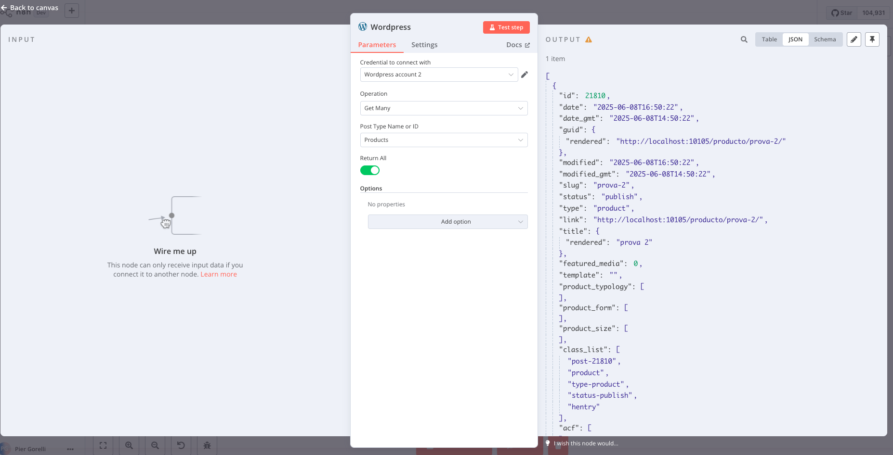

In these last days of spring, before summer officially begins, I started experimenting with automation to create a chatbot capable of interacting with WordPress site content. The challenge was to build a stable MVP, quick to implement, with a good quality/time-cost ratio. The choice fell on **n8n**.

---

## The Problem: Official WordPress Node Limitations

n8n provides various nodes to obtain data from many sources, including WordPress, thanks to the dedicated official node. However, this node only supports three content types: **posts**, **pages**, and **users**. For those who use **Custom Post Types (CPT)**, this represents a significant limitation.

### Workaround with HTTP Request

One possible solution is to use the **HTTP Request** node to point directly to the desired endpoint, for example:

```
/wp-json/wp/v2/products
```

This workaround works, but presents several complexities:

* **Manual authentication management**
* **Non-standardized data structure**
* **Lack of guided interface** for filtering or exploring content

### The Pagination Problem

One of the main problems that led me to develop a custom node is the need to obtain **all contents** of a Custom Post Type.

WordPress, for performance reasons, **limits to 100** the maximum number of elements returned for each request via REST API.

One possible solution is to create a **loop** in the n8n workflow, incrementing the **page** parameter until all data is obtained. However, a much **cleaner and integrated** solution is the one offered directly by the official WordPress node: the **Get Many** operation with the **Return All** flag, which automatically handles internal pagination.

## Solution

For the solution, I started from n8n's standard repository, which provides all necessary dependencies and the linter for static code analysis: [n8n-nodes-starter](https://github.com/n8n-io/n8n-nodes-starter).

For the code structure, a good foundation was provided by the official WordPress node, which allows performing the following operations on **Posts**, **Pages**, and **Users**:

* **Get**
* **Get Many**
* **Create**
* **Update**
* **Delete**

### Different Approach: Dynamic Post Type Selection

The logic of the new node is slightly different: instead of pre-selecting the resource to work with, we subsequently select the post type from those provided by the `types` endpoint of WordPress REST APIs.

### Dynamic Field Implementation

To do this, we need a new node property: an options field dynamically populated by the `getPostTypes` method.

**Definition in CtpDescription.ts:**
```typescript
{
  displayName: 'Post Type Name or ID',
  name: 'postType',
  type: 'options',
  typeOptions: {
    loadOptionsMethod: 'getPostTypes',
  },
  required: true,
  default: '',
  description: 'The post type to work with (post, page, or any custom post type). Choose from the list, or specify an ID using an <a href="https://docs.n8n.io/code/expressions/">expression</a>.',
}
```

**Method implementation in WordpressCpt.node.ts:**
```typescript
async getPostTypes(this: ILoadOptionsFunctions): Promise<INodePropertyOptions[]> {
  const returnData: INodePropertyOptions[] = [];
  const types = await wordpressApiRequest.call(this, 'GET', '/types', {});
  
  for (const [_, type] of Object.entries(types)) {
    const { name: typeName, rest_base: typeRestBase } = type as { name: string; rest_base: string };

    returnData.push({
      name: typeName,
      value: typeRestBase,
    });
  }
  
  return returnData;
}
```

### Dynamic Endpoint Management

The `types` endpoint returns a JSON object with all post_types configured in the WordPress installation. For the option `value`, we use the `rest_base` property, which will provide the endpoint on which the various methods will operate.

API calls are handled by two functions in **GenericFunctions.ts**:
* `wordpressApiRequest`
* `wordpressApiRequestAllItems`

### Key Difference

The difference compared to the official WordPress node is the way endpoints are managed, which are no longer hardcoded but are provided by the `postType` property we defined above.

For example, the `getAll` method calls the endpoint passing the `postType` variable, thus allowing dynamic work with any Custom Post Type present in the WordPress installation.

## Solution Advantages

### 1. Total Flexibility
* Automatic support for all Custom Post Types
* Familiar interface for official WordPress node users
* No manual endpoint configuration

### 2. Automatic Pagination Management
* "Return All" flag to retrieve all content
* Transparent management of 100-element per request limits
* No manual loop needed in the workflow

### 3. Improved User Experience
* Dynamic dropdown with all available post types
* Same usage pattern as the official node
* Integrated authentication management

## Results

The custom node allowed to:
* **Eliminate workarounds** with HTTP Request
* **Significantly reduce** chatbot development times
* **Handle thousands of custom content** without manual interventions
* **Maintain consistency** with the existing n8n ecosystem

## How to Test the Node

To test the node on an n8n installation:

1. Clone the repository
2. Install dependencies: `npm install`
3. Build: `npm run build`
4. Link the package: `npm link`
5. Inside the `~/.n8n/custom` folder (create it if it doesn't exist), run: `npm link n8n-nodes-wordpress-cpt`

## Screenshot



## Conclusions

The development of this custom node demonstrates how it's possible to extend n8n for specific use cases, starting from work already done by the community and adding missing functionalities.

The keys to success were:

1. **Intelligent reuse** of existing code
2. **Incremental approach** starting from identified limitations
3. **Focus on user experience** maintaining familiar patterns
4. **Dynamic endpoint management** instead of hardcoded solutions

For those who frequently work with Custom Post Types in WordPress, this approach offers a robust and scalable solution that integrates perfectly into the n8n ecosystem.

## Resources


- [github repository for this node](https://github.com/lupin72/n8n-wordress-custom-node#:~:text=Settings-,n8n%2Dwordress%2Dcustom%2Dnode,-Public)
- [n8n Documentation - How to create a custom node](https://docs.n8n.io/integrations/creating-nodes/overview/)
- [Wordpress node documentation](https://docs.n8n.io/integrations/builtin/app-nodes/n8n-nodes-base.wordpress/)