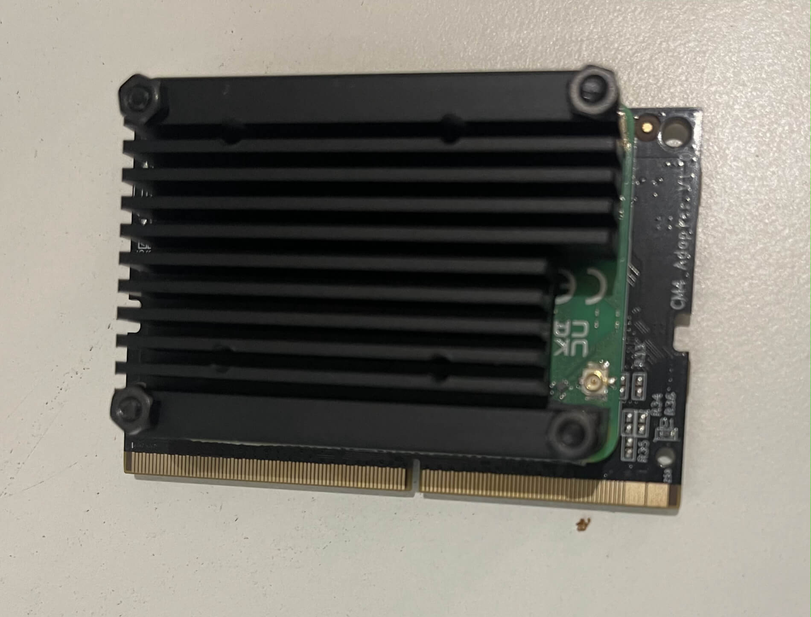

## Introduction

Three years ago, I stumbled upon the **Kickstarter** campaign for the **Turing Pi 2** — a compact and surprisingly versatile mini cluster board. The project promised to transform a corner of my desk into a tiny home data center, with support for up to four Raspberry Pi CM4 modules, Nvidia Jetson, or Turing RK1.

My initial idea — which stood the test of time — was to build a Kubernetes cluster to experiment with, learn from, and maybe even have a little fun.

Without a clear plan, I backed the campaign anyway, and it turned out to be a huge success. After several months of waiting — between high demand and some production hiccups — the package finally arrived: a bare board inside a simple antistatic bag, protected by a shockproof box. Nothing more, nothing less — essential, as is often the case with independent hardware projects.

I immediately got to work gathering all the necessary components, and then came the first cold shower: the global chip shortage had made Raspberry Pis nearly impossible to find.

The CM4 modules, in particular, seemed to have vanished from the market. And when they were available, they were being sold at outrageous prices — often double or triple the MSRP.

So I shelved the project, hoping the supply situation would eventually stabilize. And as often happens in these cases, time passed, and what began with enthusiasm turned into a forgotten little item: a dusty antistatic bag left on the bookshelf.

Last month, while organizing, I picked up that bag and thought: now or never. So, after a couple of weeks of planning purchases — and a few more waiting for deliveries — the little beast now sits on my desk as I write this article about my assembly experience, hoping it might help another tech freak out there.

---

## What I used

- 2x CM4 8GB RAM, 32GB eMMC  
- 2x CM4 4GB RAM, 32GB eMMC  
- 1x Mini ITX case ([Turing Mini ITX](https://turingpi.com/product/turing-mini-itx-case/))  
- 4x CM4 Adapters ([Turing Pi Adapter](https://turingpi.com/product/cm4-adapter/))  
- 4x Geekworm Aluminium Alloy Heatsink ([Amazon](https://www.amazon.com/Geekworm-Thickness-C235-Compatible-Motherboard/dp/B08QMTVCJW/))
- 1x Flex ATX Power Supply (FSP Flexguru - [Amazon](https://www.amazon.com/FSP-Modular-gesti%C3%B3n-Cables-eficiencia/dp/B08WQ491BY?th=1))  
- 1x SSD (Crucial 1TB - [Amazon](https://www.amazon.com/Crucial-BX500-NAND-2-5-Inch-Internal/dp/B07YD579WM/?th=1))  
- 1x SATA Cable 60cm ([Amazon](https://www.amazon.com/CableCreation-2-Pack-8-inch-Female-Locking/dp/B01IBA41UK/?th=1))  
- 1x Noctua 120mm ([Amazon](https://www.amazon.com/Noctua-NF-A12x25-PWM-Premium-Quality-Quiet/dp/B07C5VG64V/))

---

## Assembly

### Power Supply

I started the assembly by installing the power supply into the designated space inside the case.  
To make the process easier, I recommend using a magnetic screwdriver, especially when securing the bracket at the bottom of the case, where access is tight.

The Flex ATX fits perfectly, and the orientation aligns well with the pre-installed cabling, simplifying the connection process.


*Flexguru Flex ATX*

### Turing Pi 2 Board

Next, I secured the Turing Pi 2 board inside the case.  
The orientation is clearly guided by the cutouts for the USB and HDMI ports. Once the screws are tightened, I connected the front panel USB cable to the board.

Then I plugged in the 24-pin ATX power connector. The Flexguru cable is a 20+4 pin — just align and insert it carefully.

The final and most delicate step was wiring the **power button and LED** to the board.  
Locate the **Front I/O pins**: 10 in total, arranged in two rows.


*Front I/O pins*

- Outer row (closest to the board edge):
  - Pin 1: P-LED (red)
  - Pin 2: GND (white)
- Inner row:
  - Pin 3 & 4: Power button (black and green)

Lastly, I installed the battery. Mine came with a brown adapter for a CR1220 cell.  
⚠️ **Don’t remove the adapter to use a larger battery (like CR2032) or the board won’t power on.**

---

### SSD

The case has space for up to three 2.5" SSDs.  
For the initial setup, I used just one, connected to one of the Turing Pi 2's two SATA ports.

After mounting the SSD in the bracket, I used a 90° SATA connector and routed the cables **under the board** to optimize airflow.  
The case has handy cutouts for cable management.

---

### CM4 Modules

Before inserting the CM4 modules, I attached **passive heatsinks** to each board:

1. Apply thermal tape to the CPU and RAM
2. Position the aluminum heatsinks
3. Secure with screws

⚠️ **Important**: the standoffs must be mounted on top of the CM4s — not underneath as some guides suggest — or the module won’t fit into the adapter.


*Geekworm mounted on CM4*

To insert the CM4s:

- Align the CPU side toward the “Turing” label on the adapter
- Press down gently until you hear the adapter clips snap into place

---

### Cooling

I installed a 120mm fan on the side of the case, facing the CM4 modules.


*Noctua fan 120mm*

The case already has four pre-drilled holes and includes screws.  
I used a **Noctua fan** with a 4-pin connector:
- Two pins: Power (V+ and GND)
- Two pins: PWM (speed control)

The Turing Pi 2 only has a 2-pin fan header, so I connected only the power pins. The fan now runs at default speed — enough for passive cooling.

💡 Mount the fan **to extract** air from the case, not blow it in.

---

## First Boot

I connected a **D-Link Archer C6** in bridge mode to my Wi-Fi and ran a cable from it to the Turing Pi 2.

To access the **BMC web interface**, I checked my router's device list for the assigned IP.

Although the BMC should be accessible via `turingpi.local`, on macOS it didn’t resolve (likely due to mDNS or Bonjour limitations).

---

## Firmware Upgrade

Upon logging into the BMC, I noticed it was running an early firmware version — limited features, and **no root SSH access**.


*Old firmware (1.x)*

I upgraded from version 1.x to 2.x as follows:

- Downloaded the image from [GitHub](https://github.com/turing-machines/turing-pi-bmc/releases)
- Flashed it to a 32GB microSD with [balenaEtcher](https://etcher.tortulandia.com/)
- Powered off the Turing Pi 2, inserted the microSD, powered it back on
- Waited for all 4 Ethernet LEDs to blink
  
- Pressed the power button **3 times** quickly to confirm the upgrade
- When the LEDs blinked **twice**, the update was complete
- Removed the microSD and rebooted

---

## Flashing the Nodes

I installed **DietPi** on all 4 CM4s — a lightweight Debian variant ideal for minimal CPU/RAM usage.

- Downloaded the image for Raspberry Pi 2/3/4/Zero 2 from [dietpi.com](https://dietpi.com)
- Used the BMC web interface to flash each CM4 via **“Flash node”**
  

---

## Enabling UART

To access the CM4s via serial console (through the USB port on the BMC), UART must be enabled.

### Steps:

```bash
ssh root@<bmc-ip>
tpi advanced msd --node 1  # for node 1 - tpi adavanced msd --node x where x = 1 to 4

mkdir /mnt/boot
mount /dev/sda1 /mnt/boot

vi /mnt/boot/config.txt
# Add this under [all]
enable_uart=1

umount /mnt/boot
tpi power off -n 1
tpi power on -n 1
```

---

## Serial Access with `picocom`

The BMC comes with `picocom` preinstalled for direct node access.

First, identify the correct device under `/dev`.  
⚠️ **Note**: Node numbering on pre-2.5 versions is non-linear:

- Node 1 → `/dev/ttyS2`
- Node 2 → `/dev/ttyS1`
- Node 3 → `/dev/ttyS4`
- Node 4 → `/dev/ttyS5`

To connect to Node 1:

```bash
picocom /dev/ttyS2 -b 115200
```

💡 **Why 115200?**  
It’s the default baud rate for Raspberry Pi serial interfaces. Without it, you’ll see garbage output or nothing at all.

In another terminal:

```bash
tpi power off -n 1
tpi power on -n 1
```

If everything is configured correctly, you’ll see the boot log in `picocom`.

Default DietPi credentials:
```text
Username: root
Password: dietpi
```

---

## What's Next

At this stage, you should have a fully assembled cluster:  
- 4 nodes, accessible via SSH  
- BMC web interface and root access via SSH  
- Serial console working for debugging

In the next post, we’ll dive into Kubernetes: installing K3s, configuring the cluster, and deploying your first containers.

**Stay tuned — the fun starts now.** 🚀