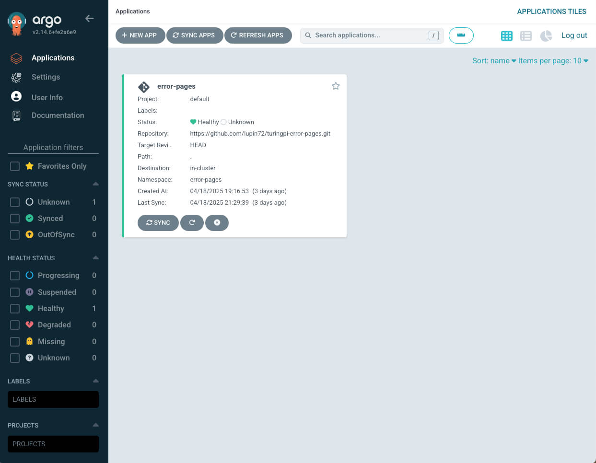
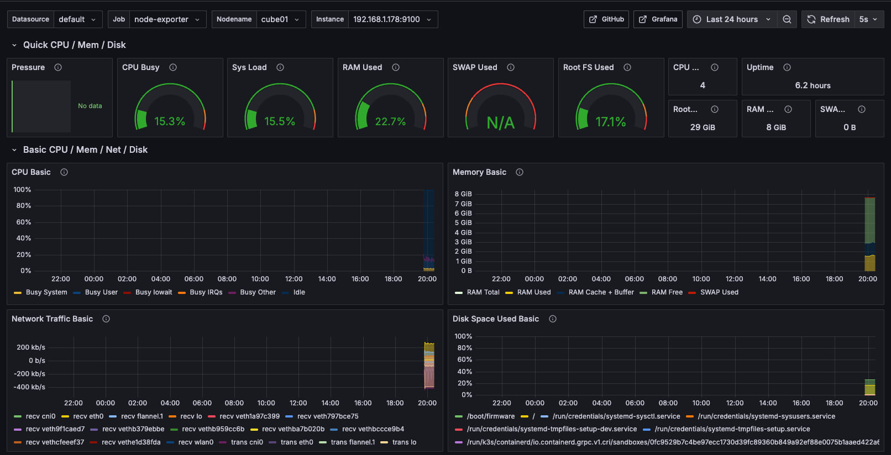

## Introduction

In the [first part](https://piergorelli.com/blog/how-to-buld-a-desktop-kubernetescluster-with-turing-pi2-part-1/) of this article, we covered how to assemble the hardware of our Kubernetes cluster using a Turing Pi 2 board with 4 Raspberry Pi Compute Module 4 units. We installed DietPi as the operating system on each node and connected an SSD to node 3 via the SATA port.

If you've followed all the steps from Part 1, you should now have:
* The BMC active and configured
* All 4 nodes accessible via SSH
* A physical cluster ready to host the software infrastructure

In this second part, we will focus on configuring the Kubernetes cluster, starting with the installation of K3s and integrating essential tools for management, monitoring, and application deployment.

## Objectives

In this second part, we’ll focus on configuring the software environment of our cluster. The goal is to create a complete, functional Kubernetes cluster ready to manage applications in a modern and modular way.

Specifically, we will:
* Install K3s to set up a lightweight and efficient Kubernetes cluster
* Install and configure Helm, the package manager for Kubernetes
* Set up MetalLB as a load balancer to assign public IPs in the cluster
* Install ArgoCD to manage GitOps-based application deployment
* Integrate Prometheus for cluster monitoring
* Add Grafana to visualize metrics through dashboards

At the end of this guide, your cluster will be ready to manage production-grade applications (or nearly 😄), and you'll be able to start experimenting with the Kubernetes ecosystem.

## Prerequisites

Before installing the Kubernetes cluster, we need to complete some system configurations on each node.

### Enable cgroups

To allow Kubernetes (and thus K3s) to function correctly, you need to enable cgroups in the kernel.

1. SSH into each node.
2. Edit the file `/boot/cmdline.txt` by adding the following to the end of the line (everything must stay on one line):

   ```console
   cgroup_enable=cpuset cgroup_enable=memory cgroup_memory=1
   ```

3. Reboot each node to apply the change. If you're using BMC with the `tpi` tool, you can do:

   ```console
   tpi power off -n 1
   tpi power on -n 1
   ```

   Repeat for each node (`-n 2`, `-n 3`, etc.).

### Set Hostnames

Assign a unique hostname to each node. I chose the following names:

* cube01
* cube02
* cube03
* cube04

You can change them via:

```console
dietpi-config > Security Options > Hostname
```

### Update the Operating System

On each node, run:

```console
apt update
apt upgrade
```

### Configure `/etc/hosts`

Update the `/etc/hosts` file on each node with the static IPs and assigned hostnames. This allows you to use hostnames instead of IP addresses.

Example:

```
192.168.1.178 cube01
192.168.1.180 cube02
192.168.1.177 cube03
192.168.1.187 cube04
```

### Install a Basic Firewall

Install a basic firewall (iptables) on each node:

```console
apt -y install iptables
```

## Installing Kubernetes with K3s

To install Kubernetes, we’ll use K3s, a lightweight distribution designed for resource-constrained environments like Raspberry Pi, but without sacrificing core Kubernetes functionality.

### Control Plane Installation

On node `cube01` (or the one you’ve chosen as master), run:

```console
curl -sfL https://get.k3s.io | sh -s - \
  --write-kubeconfig-mode 644 \
  --disable servicelb \
  --token myrandompassword \
  --node-ip 192.168.1.178 \
  --disable-cloud-controller \
  --disable local-storage
```

**Note**: Replace `myrandompassword` with a secure token and save it—you’ll need it to join other nodes.

**Explanation of options**:
* `--write-kubeconfig-mode 644`: makes the kubeconfig file readable by other users (e.g., Rancher)
* `--disable servicelb`: disables the built-in service load balancer as we'll use MetalLB
* `--token`: custom token to allow other nodes to join the cluster
* `--node-ip`: local IP of the node (adjust to your setup)
* `--disable-cloud-controller`: disables the cloud controller, not needed in bare-metal setups
* `--disable local-storage`: disables K3s local storage — we’ll use NFS instead

### Verify

After installation, verify the master node status with:

```console
kubectl get nodes
```

Expected output:

```
NAME     STATUS   ROLES                       AGE     VERSION
cube01   Ready    control-plane,master        6m22s   v1.25.6+k3s1
```

### Worker Node Installation

To join the other nodes (e.g., cube02, cube03, cube04) to the control plane, run this on each node:

```console
curl -sfL https://get.k3s.io | K3S_URL=https://192.168.1.178:6443 K3S_TOKEN=myrandompassword sh -
```

Replace:
* `192.168.1.178` with the IP of the master node
* `myrandompassword` with the token used earlier

After a few seconds, you should see the nodes join the cluster. Verify from the master node:

```console
kubectl get nodes
```

Example output:

```
NAME     STATUS   ROLES                       AGE     VERSION
cube01   Ready    control-plane,master        10m     v1.25.6+k3s1
cube02   Ready    <none>                      2m      v1.25.6+k3s1
cube03   Ready    <none>                      2m      v1.25.6+k3s1
cube04   Ready    <none>                      1m      v1.25.6+k3s1
```

### Label the Nodes

Optional but recommended: labeling nodes allows Kubernetes to assign custom roles, enabling better workload distribution.

```console
kubectl label nodes cube01 kubernetes.io/role=worker
kubectl label nodes cube02 kubernetes.io/role=worker
kubectl label nodes cube03 kubernetes.io/role=worker
kubectl label nodes cube04 kubernetes.io/role=worker
```

To verify:

```console
kubectl get nodes --show-labels
```

## Installing Helm

Helm is the go-to package manager for Kubernetes. It allows you to install, update, and manage complex applications through simple commands and configuration files called charts.

### Manual Installation on cube01 (master)

1. Install Git (required for some Helm charts):

   ```console
   apt -y install git
   ```

2. Configure the kubeconfig file:

   ```console
   export KUBECONFIG=~/.kube/config  
   mkdir -p ~/.kube  
   sudo k3s kubectl config view --raw > "$KUBECONFIG"  
   chmod 600 "$KUBECONFIG"  
   echo "KUBECONFIG=$KUBECONFIG" >> /etc/environment
   ```

3. Download and install Helm:

   ```console
   cd ~
   mkdir helm
   cd helm
   curl -fsSL -o get_helm.sh https://raw.githubusercontent.com/helm/helm/main/scripts/get-helm-3
   chmod 700 get_helm.sh
   ./get_helm.sh
   ```

4. Verify the installation:

   ```console
   helm version
   ```

---

## Networking with MetalLB

MetalLB is a load balancer for bare-metal environments, allowing you to expose Kubernetes services using assignable IP addresses in your local network. It’s essential if you want to access your services externally without a cloud provider.

### Installing MetalLB

On the master node (`cube01`):

1. Add the MetalLB Helm repository:

   ```console
   helm repo add metallb https://metallb.github.io/metallb
   helm repo update
   ```

2. Confirm the chart is available:

   ```console
   helm search repo metallb
   ```

3. Install MetalLB:

   ```console
   helm upgrade --install metallb metallb/metallb --create-namespace \
     --namespace metallb-system --wait
   ```

### Configure the IP Address Pool

Assign an IP range for MetalLB to use. Adjust based on your network setup and make sure these IPs are not used by other devices.

```yaml
cat << 'EOF' | kubectl apply -f -
apiVersion: metallb.io/v1beta1
kind: IPAddressPool
metadata:
  name: default-pool
  namespace: metallb-system
spec:
  addresses:
  - 192.168.1.240-192.168.1.250
---
apiVersion: metallb.io/v1beta1
kind: L2Advertisement
metadata:
  name: default
  namespace: metallb-system
spec:
  ipAddressPools:
  - default-pool
EOF
```

### Verify

You should see:

```
ipaddresspool.metallb.io/default-pool created
l2advertisement.metallb.io/default created
```

---

## Storage Configuration with NFS

To handle persistent storage in the cluster, this setup uses an NFS server based on an SSD connected to the SATA port on node 3 (`cube03`). This allows you to centralize shared volumes for use in Kubernetes pods.

### Identify the Disk

SSH into `cube03` and run:

```console
fdisk -l
```

Example output:

```
Disk /dev/sda: 931.51 GiB, 1000204886016 bytes, 1953525168 sectors
Disk model: CT1000BX500SSD1
```

### Format and Mount the Disk

Format the disk as ext4:

```console
mkfs.ext4 /dev/sda
```

Create a mount point and configure automatic mounting:

```console
mkdir /data
echo "/dev/sda /data ext4 defaults 0 0" | tee -a /etc/fstab
mount -a
```

Verify the mount:

```console
df -h /data
```

### Install and Configure the NFS Server

Install the NFS server package:

```console
apt install -y nfs-server
```

Export the `/data` directory:

```console
echo "/data *(rw,no_subtree_check,no_root_squash)" | tee -a /etc/exports
```

Enable and start the NFS service:

```console
systemctl enable --now nfs-server
```

Reload and re-export:

```console
exportfs -ar
```

Verify:

```console
showmount -e localhost
```

### Install the NFS Client on Other Nodes

On nodes `cube01`, `cube02`, and `cube04`:

```console
apt install -y nfs-common
```

Your cluster can now use `/data` as shared storage via NFS.

## Installing the NFS StorageClass

In Kubernetes, a StorageClass defines the type of storage that can be dynamically provisioned for pods. It is an abstraction layer that allows the creation of Persistent Volumes (PV) automatically when an application requests a Persistent Volume Claim (PVC).

### Key Concepts

* **Persistent Volume (PV)**: a portion of storage in the cluster, either statically or dynamically provisioned.
* **Persistent Volume Claim (PVC)**: a request by an application for a specific type and amount of storage.
* **StorageClass**: defines how a PV should be created based on a PVC request.

Relationship:
```
PVC ➜ requests storage ➜ StorageClass ➜ defines how it's created ➜ PV ➜ is assigned
```

### The Provisioner: nfs-subdir-external-provisioner

To use NFS in our cluster, we'll install the `nfs-subdir-external-provisioner`, a controller that automatically manages subfolders in an NFS export for each PVC request.

### Install via Helm

Run on the master node (`cube01`):

```console
helm repo add nfs-subdir-external-provisioner https://kubernetes-sigs.github.io/nfs-subdir-external-provisioner/
helm repo update

helm install nfs-subdir-external-provisioner nfs-subdir-external-provisioner/nfs-subdir-external-provisioner \
  --set nfs.server=192.168.1.177 \
  --set nfs.path=/data \
  --create-namespace \
  --namespace nfs-system
```

### Verify the StorageClass

After installation, verify:

```console
kubectl get storageclass
```

Example output:

```
NAME           PROVISIONER                                  RECLAIMPOLICY   VOLUMEBINDINGMODE   ALLOWVOLUMEEXPANSION   AGE
nfs-client     cluster.local/nfs-subdir-external-provisioner   Delete          Immediate           true                  10m
```

---

## Installing ArgoCD

ArgoCD is a DevOps tool for Kubernetes that enables the GitOps model: applications are defined as code in a Git repository and ArgoCD automatically syncs and deploys them in the cluster.



### Installation

Run on the master node (`cube01`):

```console
kubectl create namespace argocd
kubectl apply -n argocd -f https://raw.githubusercontent.com/argoproj/argo-cd/stable/manifests/install.yaml
```

Wait until all pods are in Running state:

```console
kubectl get pods -n argocd
```

Expected output:

```
NAME                                             READY   STATUS    RESTARTS   AGE
argocd-application-controller-0                  1/1     Running   0          3d
argocd-applicationset-controller-xxx             1/1     Running   0          3d
argocd-dex-server-xxx                            1/1     Running   0          3d
argocd-notifications-controller-xxx              1/1     Running   0          3d
argocd-redis-xxx                                 1/1     Running   0          3d
argocd-repo-server-xxx                           1/1     Running   0          3d
argocd-server-xxx                                1/1     Running   0          3d
```

### Retrieve the Login Password

```console
kubectl -n argocd get secret argocd-initial-admin-secret -o jsonpath="{.data.password}" | base64 -d; echo
```

### Accessing the UI via MetalLB

Expose ArgoCD’s web interface using a LoadBalancer:

```console
kubectl patch service argocd-server -n argocd --patch '{ "spec": { "type": "LoadBalancer", "loadBalancerIP": "192.168.1.242" } }'
```

Check:

```console
kubectl get svc -n argocd
```

---

## Installing Prometheus and Grafana

Prometheus is a monitoring and alerting system developed by SoundCloud and now part of the CNCF. It is designed to collect metrics from cloud-native environments like Kubernetes.

Grafana, integrated into this stack, enables visualization of metrics via interactive, customizable dashboards.

### Installation

On the master node (`cube01`), run:

```console
helm repo add prometheus-community https://prometheus-community.github.io/helm-charts
helm repo update

helm install prometheus prometheus-community/kube-prometheus-stack \
  --namespace monitoring \
  --create-namespace \
  --set prometheus.prometheusSpec.storageSpec.volumeClaimTemplate.spec.storageClassName=nfs-client \
  --set prometheus.prometheusSpec.storageSpec.volumeClaimTemplate.spec.resources.requests.storage=2Gi \
  --set grafana.persistence.enabled=true \
  --set grafana.persistence.storageClassName=nfs-client \
  --set grafana.persistence.size=2Gi
```

### Verify

```console
kubectl get pods -n monitoring
```

### Retrieve Grafana Admin Password

```console
kubectl get secret --namespace monitoring prometheus-grafana -o jsonpath="{.data.admin-password}" | base64 -d; echo
```

### Accessing Grafana via MetalLB

Expose Grafana via a LoadBalancer IP:

```console
kubectl patch svc prometheus-grafana -n monitoring \
  --patch '{ "spec": { "type": "LoadBalancer", "loadBalancerIP": "192.168.1.243" } }'
```

Check:

```console
kubectl get svc -n monitoring
```

---

## Creating Monitoring Dashboards

1. Log in to the Grafana web UI
2. Enter the admin credentials and change the password if prompted

### Add Prometheus as a Data Source

Go to: **Connections → Data sources** and add a new source:

* Type: Prometheus
* URL: http://prometheus-kube-prometheus-prometheus.monitoring.svc.cluster.local:9090

Click Save & Test.

### Import Preconfigured Dashboards

**Node Monitoring Dashboard**  
Go to: **Dashboard → New → Import** and enter the ID: `1860`

**K3s Cluster Monitoring Dashboard**  
Import using ID: `15282`

You now have full visibility into CPU, RAM, storage, traffic, and cluster health directly from Grafana.


---

## Conclusion

At this point, your Kubernetes cluster based on Turing Pi 2 and Raspberry Pi CM4 is complete and fully operational, with all essential components for modern application management:

* K3s as a lightweight and reliable Kubernetes distribution
* Helm to simplify installation and management of services
* MetalLB for exposing services in bare-metal environments
* NFS as shared persistent storage
* ArgoCD for GitOps-based application deployment
* Prometheus and Grafana for monitoring and visualizing metrics

This setup provides a solid foundation to experiment with Kubernetes, automate application delivery, monitor system health, and easily scale new features.